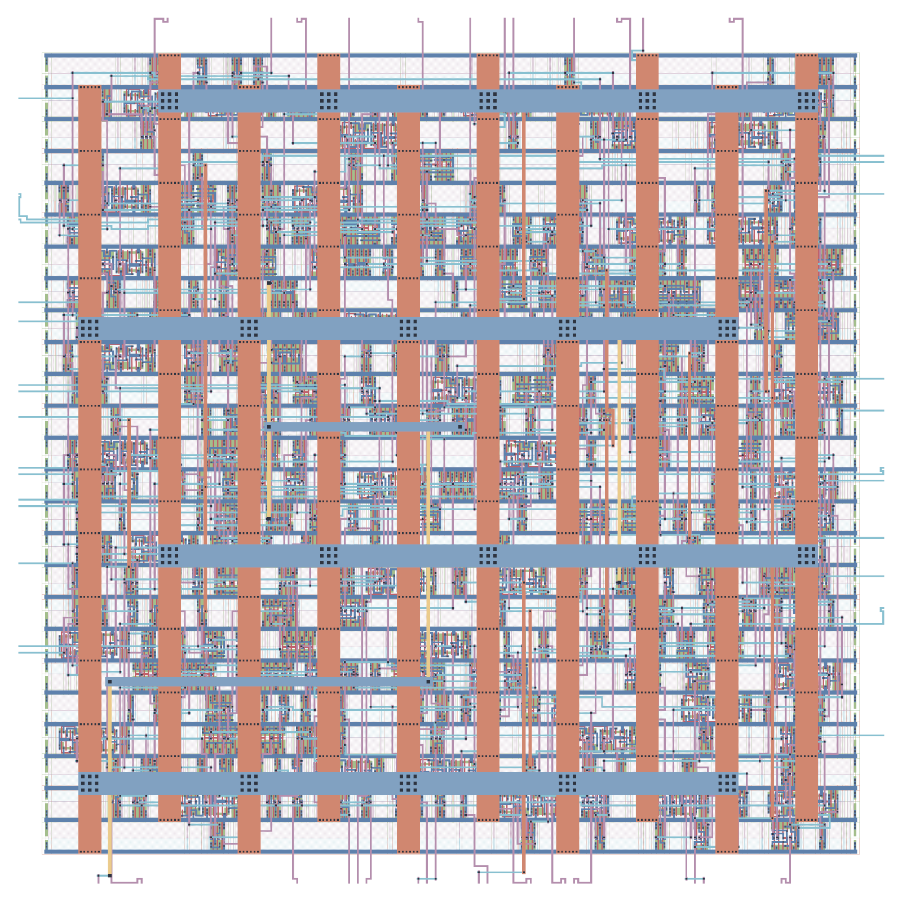
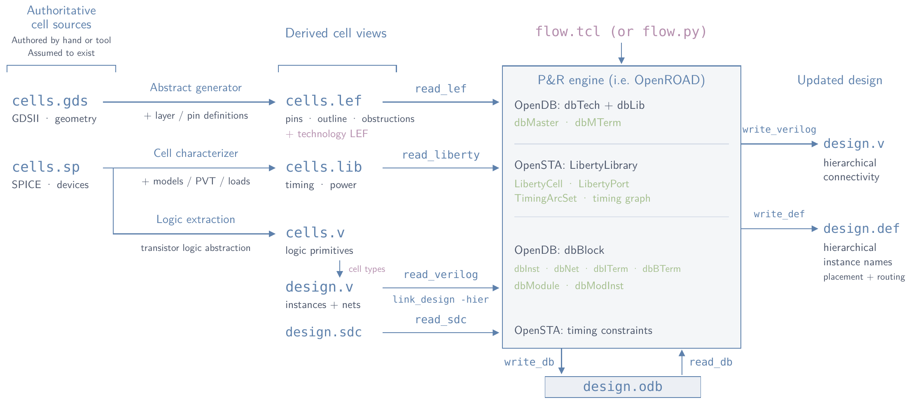

# HOTPOT: physical design with open-source tools

Slides and examples for the Hands-On Tutorial for Physical Design with Open-Source Tooling. Start with the [workshop introduction](slides/intro.pdf), then follow the presentations below from design files through fabrication. The [workshop poster](poster/hotpot-workshop-poster.pdf) is also available.

  

This workshop assumes the gate-level Verilog netlists have already been authored, either manually or with a synthesis tool, and takes the design through to a finished layout. OpenROAD is the only required dependency ([installation instructions](https://openroad.readthedocs.io/en/latest/user/Build.html)). KLayout is optional for the final step if you want to convert a `.def` layout to a `.gds` file.

## Presentations

For each stage, read the background lecture first, then the workshop tutorial. The background decks are PDF-only; the workshop decks also have TeX source in `slides/`.

| Stage | Background lecture | Workshop tutorial |
| --- | --- | --- |
| Cells and design files | [Transistor-level layout](slides/leafcell.pdf) | [Design file types](slides/filetypes.pdf) · [Liberty](slides/lib.pdf) · [DEF](slides/def.pdf) |
| Floorplanning and pins | [Floorplanning, macro placement and pin placement](slides/floorplanning-paula.pdf) | [Floorplanning in OpenROAD](slides/floorplanning.pdf) |
| Placement | [Placement in OpenROAD](slides/placement-martin.pdf) | [Placement tutorial](slides/placement.pdf) |
| Clock tree and timing | [Clock-tree synthesis and timing closure](slides/clocktree-synthesis-louis.pdf) | [CTS and timing paths](slides/cts.pdf) |
| Routing | [Global routing](slides/openroad_global_routing.pdf) · [Detailed routing](slides/openroad_detailed_routing_beamer.pdf) | [Routing tutorial](slides/routing.pdf) |
| Finishing and verification | — | [Finishing, export, DRC and LVS](slides/finishing.pdf) |

After implementation: [Chip fabrication and shared wafers](slides/fab.pdf).
