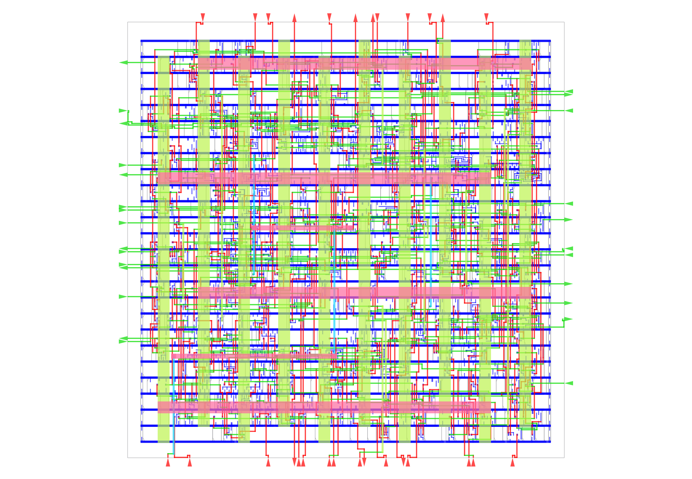

# HOTPOT development sources

This `dev` branch contains the presentation generators, Tcl flow, circuit
examples, simulations and editable artwork. The `main` branch is the attendee
release, based on the university GitLab repository and mirrored on GitHub.

- [Public workshop repository](https://gitlab.uni-bonn.de/hotpot-workshop/hotpot-chip-design-workshop)
- [Development slide sources](docs/slides/README.md)
- [Publishing instructions](docs/slides/PUBLISHING.md)

## OpenROAD Tutorial

This repository contains a single-file OpenROAD physical-design flow for the
Nangate45 GCD benchmark. It takes the synthesized gate-level netlist through
floorplanning, power-grid generation, placement, timing repair, clock-tree
synthesis, routing, parasitic extraction, and final design export.

The flow uses the open-source example Nangate45 technology files included in
the main OpenROAD repository (OpenROAD-flow-scripts is not required).

## Setup

Follow the official [OpenROAD download and build instructions](https://openroad.readthedocs.io/en/latest/user/Build.html).

Clone this repository beside the OpenROAD source checkout so that the Tcl file
can read its inputs from `../OpenROAD/test`:

```text
parent-directory/
├── OpenROAD/
└── hotpot
```

## Run

From this repository, run:

```sh
mkdir -p results images
openroad -gui -threads max -no_init -log results/run.log -metrics results/metrics.json flow.tcl
```

The completed routed design and its clock tree remain open in the GUI. Close
the GUI when you are finished. Generated checkpoints, reports, layouts, logs,
and metrics are written to `results/`; screenshots are written to `images/`.

## Expected result


